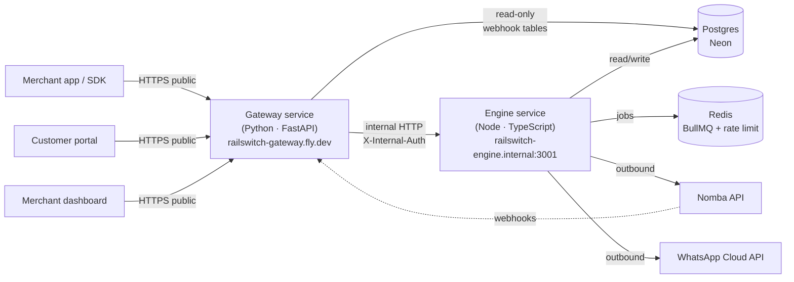
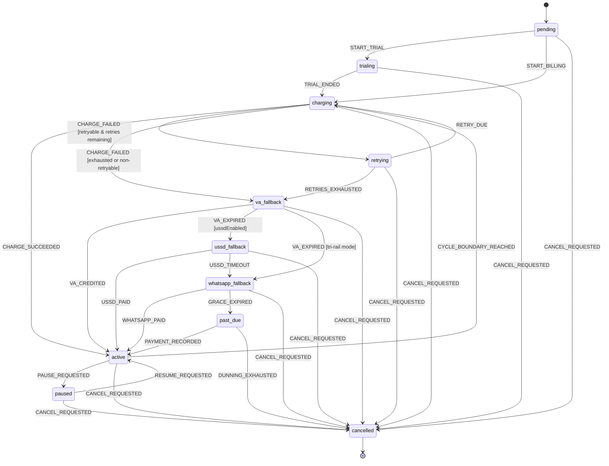
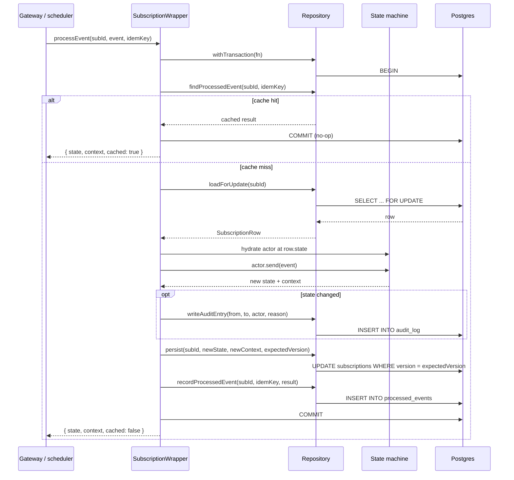
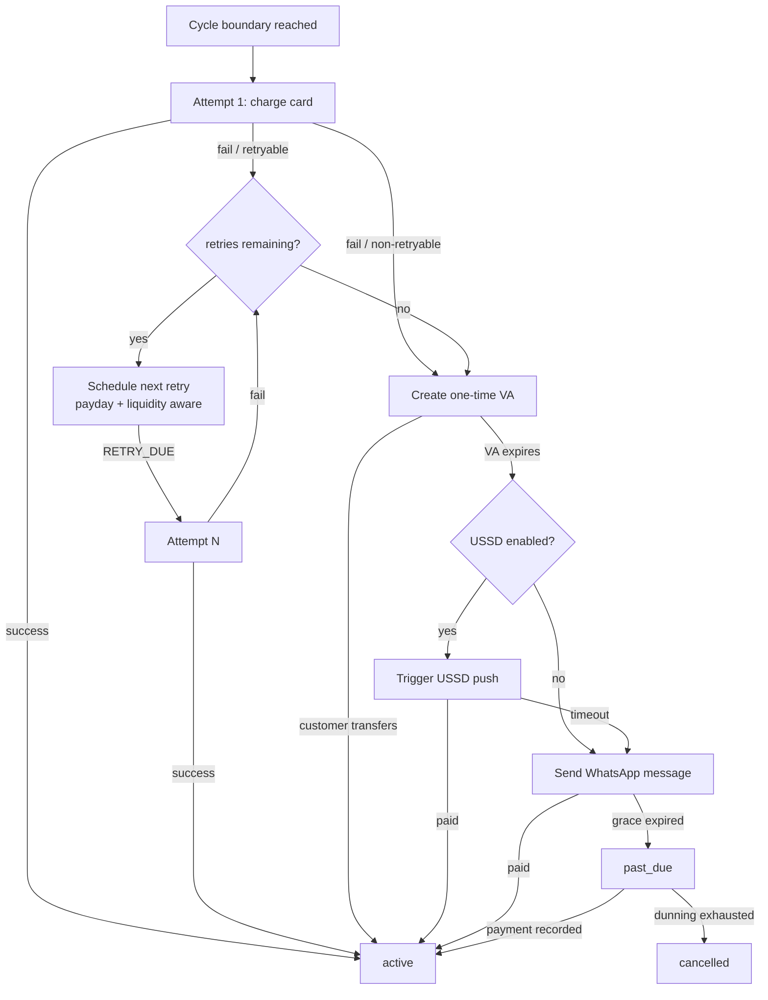
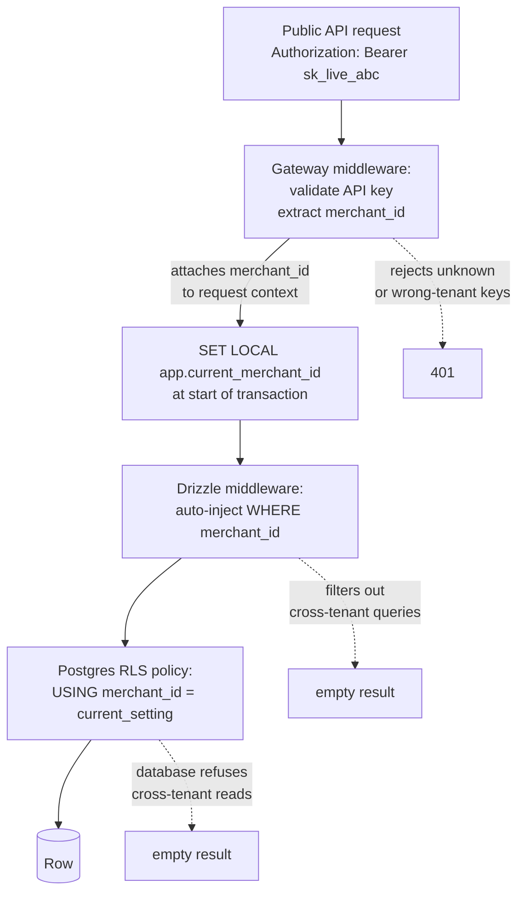

# RailSwitch Architecture

This document describes how RailSwitch is built — the services, the state machine, the data flow, the multi-tenancy model, and the operational topology. It's the single place to understand how the pieces fit. For specific contracts (schema column names, internal HTTP routes), see the linked sub-documents.

**Audience:** judges evaluating the system, engineers onboarding, future maintainers.

---

## 1. The problem we solve

Nigerian recurring card declines run 20–30%. Stripe, Adyen, Razorpay, Paystack, and Flutterwave all retry the card a few times and give up. The customer churns — not because they lost interest, but because their card didn't work that day.

But most Nigerian customers *can* pay. They can transfer from their banking app. They have USSD codes memorized. They have WhatsApp.

RailSwitch is the recovery layer: when a card fails, we cascade through smarter retries, a one-time virtual account, a USSD push, and a WhatsApp message until the customer pays. The subscription stays alive. The merchant keeps the revenue.

**Positioning:** Stripe collects recurring revenue. RailSwitch recovers it.

---

## 2. System topology

Two services, one shared Postgres database, one Redis. The split is deliberate: TypeScript where the state machinery lives, Python where the public API surface lives.



**Why two services and not one:**

- **Polyglot benefits.** FastAPI's automatic OpenAPI generation from Pydantic is the cleanest way to feed a Mintlify docs site, a TypeScript SDK, and a Python SDK from one source of truth. We use that. The state machine, by contrast, is XState, which is TypeScript. Forcing both into one language costs more than the polyglot boundary does.
- **Internal isolation.** The engine is unreachable from the public internet. It only exists at `railswitch-engine.internal:3001` inside Fly's private network. The gateway is the only thing that can talk to it, authenticated via a shared secret. This is defense in depth — even if the gateway is compromised, the engine's surface is small and the database is RLS-scoped.
- **Independent scaling.** Webhook fan-out (gateway) and state machine processing (engine) have different load profiles. Two services means independent autoscaling.

**Production URLs:**
- Gateway: `https://railswitch-gateway.fly.dev` (public)
- Engine: `http://railswitch-engine.internal:3001` (Fly internal only)
- Database: Neon Postgres, EU-West-2
- Redis: Upstash

---

## 3. The state machine

Every subscription is governed by an XState v5 state machine. Pure state graph — no IO, no database, no Nomba imports. The machine knows about states, transitions, guards, and context. Side effects are the wrapper's responsibility.

### States



### Key design decisions

**`pending` is the entry state, not `trialing`.** Subscriptions can be created with or without a trial. From `pending`, `START_TRIAL` goes to trialing, `START_BILLING` goes straight to charging. Same machine handles both signup-with-trial and signup-without-trial paths.

**`retrying` is a top-level state, not a substate of `charging`.** Each retry attempt is its own auditable transition. The audit log reads `active → charging → retrying → charging → retrying → charging → va_fallback` instead of one ambiguous "retrying" entry with a counter buried in context. Judges (and ops) get a legible cascade story.

**Trial-end goes through `charging`, not directly to `active`.** This means the same charge/retry/cascade machinery handles trial conversion as renewal. One code path, not two.

**USSD is policy-driven, not hardcoded.** Each merchant's `DunningPolicy.ussdEnabled` flag switches between quad-rail (card → VA → USSD → WhatsApp) and tri-rail (card → VA → WhatsApp). Built this way because Nomba sandbox USSD availability is unconfirmed and we may need to ship tri-rail on Day 1 of the hackathon window.

**Pause is only reachable from `active`.** Mid-cascade pause opens product questions (do VAs get cancelled? do retry counters reset on resume?) that don't pay off in the demo. Pause exits the steady state, not the recovery flow.

**`cancelled` is terminal.** Cancellation is final. Resurrecting a cancelled subscription means creating a new one.

### Where the code lives

- State machine: `services/engine/src/state-machines/subscription.ts`
- Tests: `services/engine/tests/state-machines/subscription.test.ts` (19 tests)

---

## 4. The transactional wrapper

The state machine is pure logic. The wrapper is what makes it usable — it handles persistence, audit logging, row locking, and idempotency, all atomically.

### Responsibilities



**What this guarantees:**

1. **Idempotent webhook delivery.** Nomba (and any caller) can send the same event twice with the same idempotency key. The second call short-circuits before any work is done and returns the original result.

2. **Concurrent webhook safety.** Two simultaneous webhooks for the same subscription (e.g., card succeeds AND VA gets credited at the same instant) serialize via the row lock. One wins, the other waits for the transaction to commit, then sees the updated state and either no-ops or transitions correctly.

3. **Atomic audit logging.** Audit entries are written in the same transaction as the state update. Either both land or neither does — the audit log can never disagree with the actual state.

4. **Optimistic concurrency defense.** Beyond the row lock, every persist checks `expectedVersion`. If the row was modified between load and save (which shouldn't happen given the lock, but might if assumptions break), the persist throws and the transaction rolls back.

5. **Failure rollback.** If any step fails — persist throws, audit write fails, anything — the entire transaction rolls back. State, audit log, idempotency cache all return to their pre-event values. The caller retries with the same idempotency key and gets a fresh attempt.

### The repository pattern

The wrapper depends on a `SubscriptionRepository` interface, not on Drizzle directly. Two implementations exist:

- `InMemorySubscriptionRepository` (tests) — full snapshot-based rollback semantics, no infrastructure required
- `DrizzleSubscriptionRepository` (production) — lands when the schema PR merges

This decoupling let us ship and test the wrapper before the schema was written. The Drizzle impl is a mechanical translation against the contract in `docs/engine-schema-contract.md`.

### Where the code lives

- Wrapper: `services/engine/src/wrapper/subscription-wrapper.ts`
- Interface: `services/engine/src/wrapper/repository.ts`
- In-memory impl: `services/engine/tests/wrapper/in-memory-repository.ts`
- Tests: `services/engine/tests/wrapper/subscription-wrapper.test.ts` (12 tests)

---

## 5. The recovery cascade

When a card charge fails, the rail orchestrator drives the state machine through the cascade. Each rail is an independent code path that the orchestrator dispatches based on the machine's current state.



### Rail 1: Smart card retries

The retry timing function (`services/engine/src/rails/retry-timing.ts`) is pure logic. Given a current time, a retry count, and a merchant policy, it computes the next retry timestamp.

Two heuristics, applied in priority order:

1. **Payday snap.** If the natural exponential-backoff candidate lands within 7 days before a payday window (25th–30th of any month), snap forward to the 25th at 11:00 WAT. Customers reliably have funds in this window.
2. **Liquidity snap.** If the candidate falls outside 10:00–14:00 WAT, push to the next available 11:00 WAT slot. This is the Nigerian banking liquidity window.

Payday wins over liquidity. WAT math is explicit (UTC+1, no DST) so host timezone has no effect.

Backoff is exponential with ±15% jitter, capped at the merchant's `maxDelayHours`. Tests pin the RNG to make timestamps exact and reproducible.

### Rail 2: Virtual account fallback

When the state machine enters `va_fallback`, the orchestrator calls `nomba.createVirtualAccount({ amount, reference: invoiceId, expiresInDays: 7 })`. The VA:
- Is amount-locked (Nomba rejects transfers of the wrong amount)
- Carries the invoice ID as the reference (the account number IS the reference, no fake-alert risk)
- Expires when paid or after the policy window

On VA credit, Nomba fires an inbound webhook. The gateway verifies the signature, the engine reconciles by reference, and the state machine receives `VA_CREDITED` → back to `active`.

This same VA mechanism powers **signup recovery**: when a customer's first card charge (at signup) fails, the system offers a VA on the spot. They transfer, the subscription activates, never having had a working card on file.

### Rail 3: USSD push (conditional)

If `DunningPolicy.ussdEnabled` is true, VA expiry routes to USSD. The orchestrator calls `nomba.triggerUSSD(...)` and the customer dials the returned code from their phone.

If `ussdEnabled` is false (tri-rail mode), VA expiry routes directly to WhatsApp. The architecture supports USSD; whether the cascade uses it is a merchant choice. This was designed for the case where Nomba sandbox USSD is unavailable — we ship tri-rail and frame USSD as "supported, pending CBN approval."

### Rail 4: WhatsApp fallback

WhatsApp Cloud API sends a templated message with VA details, the USSD code (if applicable), and a Nomba checkout link. Customer pays through whichever channel works. Webhook fires, state returns to `active`.

If the grace window expires without payment, the state machine transitions to `past_due`. From there, the customer can still recover by paying out-of-band (via the portal, by updating their card, etc.) — `PAYMENT_RECORDED` returns them to `active`. If the merchant's policy exhausts, `DUNNING_EXHAUSTED` cancels.

### Where the code lives

- Retry timing: `services/engine/src/rails/retry-timing.ts`
- Orchestrator: `services/engine/src/rails/orchestrator.ts`
- Nomba interface: `services/engine/src/rails/nomba-client.ts`
- Mock client: `services/engine/src/rails/mock-nomba-client.ts`

---

## 6. Multi-tenancy

Three layers of defense. Each independent, each catches different failure modes.



**Layer 1 — Application:** Every API key is scoped to one merchant. The format is `sk_live_<random>` or `sk_test_<random>`. The gateway middleware validates the key, extracts `merchant_id`, and attaches it to the request context.

**Layer 2 — ORM:** Drizzle middleware wraps the database client. Every query against a tenant-scoped table gets a `WHERE merchant_id = $1` clause injected automatically. There is no codepath that issues a query without this filter.

**Layer 3 — Database:** Postgres Row-Level Security policies on every tenant-scoped table. At the start of each request, `SET LOCAL app.current_merchant_id = '<id>'`. RLS policies reference this setting. Even if application code has a bug and tries to read another merchant's data, the database itself refuses.

**Layer 4 — Tests:** A cross-tenant test suite verifies this. For every tenant-scoped endpoint:
1. Create resource as Merchant A
2. Attempt to read with Merchant B's key
3. Assert `404 Not Found` (not `403` — `403` leaks existence)

This is in CI. PRs that break tenant isolation fail to merge.

**Plus:** per-merchant rate limiting via Redis token buckets, per-merchant webhook signing secrets, audit log scoped to merchant.

---

## 7. Webhooks (both directions)

### Inbound — from Nomba

Nomba fires webhooks for card events (success, failure) and VA events (credited, expired). The gateway receives them, verifies the signature, and forwards the event to the engine via internal HTTP.

```mermaid
sequenceDiagram
    participant Nomba
    participant Gateway
    participant Engine
    participant DB
    Nomba->>Gateway: POST /webhooks/nomba<br/>X-Nomba-Signature: sha256=...
    Gateway->>Gateway: verify signature<br/>against shared secret
    Gateway->>Gateway: dedupe by event_id<br/>(processed_events table)
    Gateway->>Engine: POST /internal/v1/events<br/>X-Internal-Auth, X-Merchant-Id
    Engine->>Engine: SubscriptionWrapper.processEvent
    Engine->>DB: BEGIN; load FOR UPDATE; ...; COMMIT
    Engine-->>Gateway: 200 { state, context }
    Gateway-->>Nomba: 200
```

If the signature is invalid: reject with 401, do not forward. If the `event_id` has been seen: return 200 (so Nomba doesn't retry forever) but do nothing else.

### Outbound — to merchants

Merchants register webhook endpoints. When events happen (`subscription.created`, `invoice.paid`, `dunning.cascade_started`, etc.), the gateway delivers signed payloads.

- Signing: HMAC-SHA256 with the merchant's secret, header `RailSwitch-Signature: sha256=<hex>`
- Retry policy: 30s, 2m, 10m, 30m, 2h, 5h, 10h, 24h. Nine attempts before marking permanently failed.
- Replay tool: merchants can re-send any delivery from the dashboard. Useful for debugging missed webhooks during integration.

Event types: `subscription.{created,updated,paused,resumed,cancelled}`, `invoice.{created,paid,payment_failed,recovered,refunded}`, `charge.{succeeded,failed}`, `dunning.{cascade_started,fallback_initiated,exhausted}`, `customer.{created,payment_method_added,payment_method_removed}`.

---

## 8. Idempotency

Idempotency is enforced at three layers, each handling different races.

| Layer | Where | Key | Purpose |
|---|---|---|---|
| Public API mutations | Gateway | `Idempotency-Key` header (UUID) | Caller retries don't double-create resources |
| Inbound webhooks | Gateway | `event_id` from Nomba | Nomba duplicate deliveries are deduped |
| State machine events | Engine wrapper | `(subscription_id, idempotency_key)` | Replays of the same event return the cached result |

The wrapper's idempotency cache (`processed_events` table) is the critical one. It means a webhook delivered three times produces exactly one state transition and one audit entry.

---

## 9. State integrity

Beyond the wrapper's transactional guarantees, the engine enforces state integrity through:

- **XState machine.** All transitions are explicit. There is no path from state A to state B that isn't a declared transition with an explicit guard. The state machine refuses invalid events (a `CHARGE_SUCCEEDED` while in `paused` is silently ignored, not applied).
- **Immutable audit log.** Every transition writes a row. No UPDATE, no DELETE. The audit log is the source of truth for "what happened" — the current state is derived from it.
- **Row-level locks.** `SELECT ... FOR UPDATE` serializes concurrent transitions of the same subscription. Concurrent transitions of *different* subscriptions are independent and proceed in parallel.
- **Optimistic version check.** Every persist passes `expectedVersion`. The row's version increments on every write. Mismatched versions throw — defense in depth on top of the lock.

---

## 10. Tech stack

**Engine (Node 20 + TypeScript):**
- Express for internal HTTP
- XState v5 for the state machine
- Drizzle ORM (TypeScript-first, multi-tenant middleware trivial to wire)
- BullMQ for scheduled retries and cycle boundaries
- pg as the Postgres driver

**Gateway (Python 3.12):**
- FastAPI for HTTP, async-native
- Pydantic v2 for request/response validation and OpenAPI generation
- SQLAlchemy 2.x + asyncpg for the read-only views
- httpx for the internal HTTP client
- FastAPI BackgroundTasks for webhook delivery

**Shared infrastructure:**
- PostgreSQL 16 (Neon, EU-West-2)
- Redis 7 (Upstash) — BullMQ queue + per-merchant rate limiting
- Internal HTTP between services, authenticated with a shared secret

**External services:**
- Nomba sandbox: Charge API, Tokenized Cards, Virtual Accounts, Transfers, Webhooks
- WhatsApp Cloud API (Meta test number)
- Resend (transactional email)

**Deployment:**
- Both services on Fly.io. Engine is internal-only (`railswitch-engine.internal`), gateway is public (`railswitch-gateway.fly.dev`).
- Database connection via Neon's pooled URL, set as a Fly secret.
- Branch protection on `main`. CI runs lint + build + tests on every PR. Merges deploy automatically.

---

## 11. Where to read more

- **Schema contract:** `docs/engine-schema-contract.md` — the locked SQL contract the wrapper depends on
- **Internal HTTP contract:** `docs/internal-api.md` — every endpoint the gateway calls on the engine
- **Code:**
  - Engine: `services/engine/`
  - Gateway: `services/gateway/`
  - SDKs: `packages/sdk-node/`, `packages/sdk-python/`
  - Examples: `examples/`
